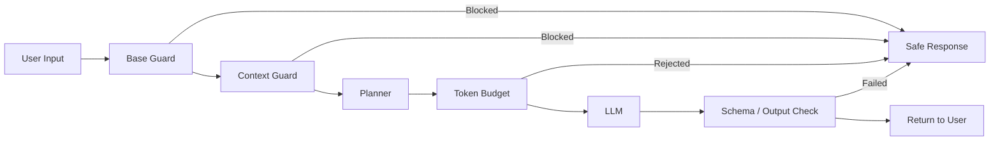

# 大框架




# 安全词检查模块

模块主要目的是拦截单词高风险输入和多轮渐进是风险输入，同时减少对正常请求的误杀。
如果之做简单的关键词拦截，会导致一个问题：当轮消息命中敏感词之后，后续所有的正常输入都会被拦截。


## 设计思路

1. `baseGuard`
	负责当前输入的快速检查，目的为拦截明显的不合法内容，避免较低风险输入进入后续的复杂扫描流程

2. `contextGuard`
	负责历史上下文的风险排查，主要包含历史风险衰减、步骤组合风险、连续安全对话奖励

## 风险计算逻辑

- 当前输入风险
- 多轮组合形成的步骤型风险
- 连续安全对话带来的恢复奖励

最终得到 `totalRisk`，超过阈值后才拦截。

```typescript

const clamp01 = (n: number) => Math.max(0, Math.min(1, n));

function recentSafeStreakBonusFromRisks(historyRisks: number[], currentRisk: number): number {
  if (currentRisk > 0.1) return 0;

  let streak = 0;
  for (let i = historyRisks.length - 1; i >= 0; i--) {
    if (historyRisks[i] <= 0.1) streak++;
    else break;
  }

  return streak >= RECOVERY_SAFE_TURNS ? RECOVERY_REDUCE : 0;
}

function scoreHistoryWithDecayFromRisks(risks: number[]): number {
  if (!risks.length) return 0;

  let weighted = 0;
  let totalWeight = 0;

  for (let i = risks.length - 1, distance = 0; i >= 0; i--, distance++) {
    const w = Math.pow(DECAY, distance);
    weighted += risks[i] * w;
    totalWeight += w;
  }

  return totalWeight > 0 ? clamp01(weighted / totalWeight) : 0;
}

function scoreStepwiseRisk(history: Message[], currentInput: string): number {
  const stepPatterns: Array<[RegExp, RegExp]> = [
    [/权限|提权|管理员/i, /日志|痕迹|记录|清理/i],
    [/入侵|攻击|渗透|hack/i, /方法|步骤|流程|脚本/i],
    [/绕过|bypass|突破/i, /验证|登录|安全|鉴权/i],
  ];

  let stepHits = 0;
  for (const [p1, p2] of stepPatterns) {
    const historyHasP1 = history.some((m) => {
      p1.lastIndex = 0;
      return p1.test(m.content);
    });
    const historyHasP2 = history.some((m) => {
      p2.lastIndex = 0;
      return p2.test(m.content);
    });

    p1.lastIndex = 0;
    p2.lastIndex = 0;
    const currentHasP1 = p1.test(currentInput);
    const currentHasP2 = p2.test(currentInput);

    if ((historyHasP1 && currentHasP2) || (historyHasP2 && currentHasP1)) {
      stepHits++;
    }
  }

  return clamp01(stepHits * 0.28);
}

function recentSafeStreakBonusFromRisks(historyRisks: number[], currentRisk: number): number {
  if (currentRisk > 0.1) return 0;

  let streak = 0;
  for (let i = historyRisks.length - 1; i >= 0; i--) {
    if (historyRisks[i] <= 0.1) streak++;
    else break;
  }

  return streak >= RECOVERY_SAFE_TURNS ? RECOVERY_REDUCE : 0;
}

function checkContextSafety(messageHistory: Message[], 			  currentInput: string): EmitOutput | null {

  // point-3: 只做一次 user 过滤和窗口截取，并复用预计算风险分
  /*
    过滤出自己 user 内容并拿出最近六条
  */
  const recentUserMessages = messageHistory.filter((m) => m.role === "user").slice(-CONTEXT_WINDOW);
  if (recentUserMessages.length === 0) return null;

  // 检测历史内容的风险值
  const historyRisks = recentUserMessages.map((m) => scoreTextRisk(m.content));

  // 当轮风险
  const currentRisk = scoreTextRisk(currentInput);

  // 历史风险
  const historyRisk = scoreHistoryWithDecayFromRisks(historyRisks);
  // 逐步风险评分
  const stepRisk = scoreStepwiseRisk(recentUserMessages, currentInput);

  // 来自风险的“安全连胜”奖励近期推出
  const recoveryBonus = recentSafeStreakBonusFromRisks(historyRisks, currentRisk);

  const totalRisk = clamp01(
    currentRisk * CURRENT_WEIGHT + historyRisk * HISTORY_WEIGHT + stepRisk - recoveryBonus,
  );

  if (totalRisk >= BLOCK_THRESHOLD) {
    return {
      type: "emit",
      payload: {
        content: "安全限制：检测到多轮上下文组合存在较高风险，请调整为明确的安全开发需求。",
      },
    };
  }

  return null;
}


// 多轮对话内容检测

export function contextGuard(input: string, messageHistory?: Message[]): EmitOutput | null {
  const text = String(input ?? "");
  if (!messageHistory || messageHistory.length === 0) return null;
  return checkContextSafety(messageHistory, text);
}

```


