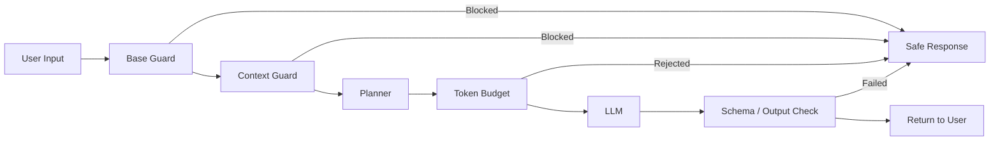

# 大框架




# 安全词检查模块

模块主要目的是拦截单词高风险输入和多轮渐进是风险输入，同时减少对正常请求的误杀。
如果之做简单的关键词拦截，会导致一个问题：当轮消息命中敏感词之后，后续所有的正常输入都会被拦截。


## 设计思路

1. `baseGuard`
	负责当前输入的快速检查，目的为拦截明显的不合法内容，避免较低风险输入进入后续的复杂扫描流程

2. `contextGuard`
	负责历史上下文的风险排查，主要包含历史风险衰减、步骤组合风险、连续安全对话奖励

## 风险计算逻辑

- 当前输入风险
- 多轮组合形成的步骤型风险
- 连续安全对话带来的恢复奖励
- 历史风险衰减值

最终得到 `totalRisk`，超过阈值后才拦截。

```typescript

const clamp01 = (n: number) => Math.max(0, Math.min(1, n));


function checkContextSafety(messageHistory: Message[], 			  currentInput: string): EmitOutput | null {

  // point-3: 只做一次 user 过滤和窗口截取，并复用预计算风险分
  /*
    过滤出自己 user 内容并拿出最近六条
  */
  const recentUserMessages = messageHistory.filter((m) => m.role === "user").slice(-CONTEXT_WINDOW);
  if (recentUserMessages.length === 0) return null;

  // 检测历史内容的风险值
  const historyRisks = recentUserMessages.map((m) => scoreTextRisk(m.content));

  // 当轮风险
  const currentRisk = scoreTextRisk(currentInput);

  // 历史风险
  const historyRisk = scoreHistoryWithDecayFromRisks(historyRisks);
  // 逐步风险评分
  const stepRisk = scoreStepwiseRisk(recentUserMessages, currentInput);

  // 来自风险的“安全连胜”奖励近期推出
  const recoveryBonus = recentSafeStreakBonusFromRisks(historyRisks, currentRisk);

  const totalRisk = clamp01(
    currentRisk * CURRENT_WEIGHT + historyRisk * HISTORY_WEIGHT + stepRisk - recoveryBonus,
  );

  if (totalRisk >= BLOCK_THRESHOLD) {
    return {
      type: "emit",
      payload: {
        content: "安全限制：检测到多轮上下文组合存在较高风险，请调整为明确的安全开发需求。",
      },
    };
  }

  return null;
}


// 多轮对话内容检测

export function contextGuard(input: string, messageHistory?: Message[]): EmitOutput | null {
  const text = String(input ?? "");
  if (!messageHistory || messageHistory.length === 0) return null;
  return checkContextSafety(messageHistory, text);
}

```


# Planner 到 Executor 的安全控制

主要目的是拦截LLM返回不符合要求的json、拦截具有风险的（请求|写入），确认操作边界范围。

## 设计思路

- ```checkPlanSafety```：检查 LLM 生成的 plan 本身是否危险
- ```policyGuard```：执行具体 task 前再检查一次权限和访问边界

## 计算风险

- web.search 搜索非法内容
- web.fetch 请求内容可疑
- file.write 写入路劲以及内容敏感
- http 访问不可访问网址

```typescript

export function checkPlanSafety(plan: Plan): PlanCheckResult {
    for (let i = 0; i < plan.steps.length; i++) {
        const step = plan.steps[i];
        const stepNum = i + 1;
        // 检查 web.search 任务
        if (step.action === 'web.search') {
            const query = String(step.params?.query ?? '');
            for (const pattern of DANGEROUS_SEARCH_QUERIES) {
                if (pattern.test(query)) {
                    return {
                        blocked: true,
                        reason: `步骤 ${stepNum} (web.search): 搜索查询包含危险关键词 "${query}"`,
                    };
                }
            }
        }
    }

    return { blocked: false };
}

export function policyGuard(task: Task, context: PolicyContext) {
    switch (task.type) {
        case 'http': {
            const params = task.params as HttpTaskParams;
            const url = String(params.url ?? '');
            if (!url) throw new PolicyError("MISSING_URL", "http task 缺少 url 参数。")
            guardHttpUrl(url, context);
            return
        }
        case 'web.search': {
            const params = task.params as SearchTaskParams;
            const q = String(params.query ?? '');
            if (!q) throw new PolicyError("MISSING_QUERY", "web.search 缺少 query");
            return;
        }
        case 'web.fetch': {
            const params = task.params as HttpTaskParams;
            const url = String(params.url ?? "");
            if (!url) throw new PolicyError("MISSING_URL", "web.fetch 缺少 url");
            guardHttpUrl(url, context);
            return;
        }
        case 'log':
        case 'emit':
        case 'export_flow':
        case 'file.write':
        case 'artifact.export':
            return;

        default: {
            const unknownTask = task as { type?: string };
            throw new PolicyError("UNKNOWN_TASK", `未知 task: ${unknownTask.type ?? 'unknown'}`)
        }
    }
}
```


# token预算

这个模块不仅限制单次请求大小，也尝试控制多轮会话累计消耗，并处理失败场景下的额度回滚。

## 设计思路

1. callLLM前检查预算
3. 根据剩余额度裁剪上下文
4. 调用前预留估算 token
5. 对于callLLM出错请求回滚token用量额度

## 关键点

这个模块不是简单的“先查再加”，而是把 token 使用控制收敛到预留和回滚流程中，减少并发下预算超扣的问题。

```typescript
export async function planner(input: string, state: SessionState) {
    // 检查token预算
  await checkTokenBudget(state.sessionId);

  const remainingBudget = await getRemainingBudget(state.sessionId);

  context = clampMessagesToBudget(context, Math.max(effectiveBudget, 1000));
    
  checkRequestBudget(context);

  const reservedTokens = estimateMessagesTokens(context);
  await recordTokenUsage(state.sessionId, reservedTokens, context);
  const rawText = await (async () => {
    try {
      return await callLLM(context);
    } catch (error) {
      await refundTokenUsage(state.sessionId, reservedTokens);
      throw error;
    }
  })();
}
```
