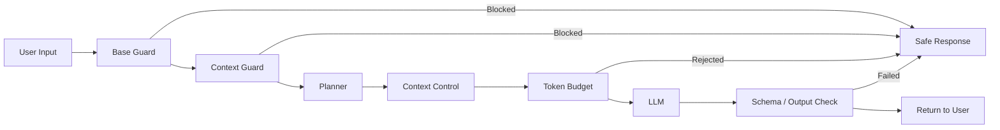

# 大概架构



# 安全词检测模块

这个模块的目标是拦截单轮高风险输入和多轮渐进式风险输入，同时尽量减少对正常请求的误杀。

如果只做简单关键词拦截，会出现一个问题：当前轮消息命中敏感词后，后续正常输入也可能持续被拦截。

## 设计思路

1. `baseGuard`
   负责当前输入的快速检查，优先拦截明显违规内容，避免低风险输入进入后续复杂扫描。

2. `contextGuard`
   负责结合历史上下文评估风险，重点处理多轮组合风险、历史风险衰减和连续安全对话奖励。

## 风险计算逻辑

- 当前输入风险
- 历史风险衰减值
- 多轮组合形成的步骤型风险
- 连续安全对话带来的恢复奖励

最终得到 `totalRisk`，超过阈值后才拦截。

```typescript
function checkContextSafety(messageHistory: Message[], currentInput: string): EmitOutput | null {
  const recentUserMessages = messageHistory
    .filter((m) => m.role === "user")
    .slice(-CONTEXT_WINDOW);
  if (recentUserMessages.length === 0) return null;

  const historyRisks = recentUserMessages.map((m) => scoreTextRisk(m.content));
  const currentRisk = scoreTextRisk(currentInput);
  const historyRisk = scoreHistoryWithDecayFromRisks(historyRisks);
  const stepRisk = scoreStepwiseRisk(recentUserMessages, currentInput);
  const recoveryBonus = recentSafeStreakBonusFromRisks(historyRisks, currentRisk);

  const totalRisk = clamp01(
    currentRisk * CURRENT_WEIGHT + historyRisk * HISTORY_WEIGHT + stepRisk - recoveryBonus,
  );

  if (totalRisk >= BLOCK_THRESHOLD) {
    return {
      type: "emit",
      payload: {
        content: "安全限制：检测到多轮上下文组合存在较高风险，请调整为明确的安全开发需求。",
      },
    };
  }

  return null;
}
```

## 收益

相比单纯关键词拦截，这种设计既能处理多轮渐进式风险，也能减少误杀和无效扫描成本。

# Planner 到 Executor 的安全控制

这个模块的目标是拦截 LLM 返回的不安全 plan，并在真正执行 task 前再次确认权限边界和访问范围。

## 设计思路

- `checkPlanSafety`：检查 LLM 生成的 plan 本身是否危险
- `policyGuard`：执行具体 task 前再检查一次权限和访问边界

这两层分别处理“计划是否危险”和“执行是否越界”两个问题。

## 重点检查内容

- `web.search` 搜索危险内容
- `web.fetch` 请求可疑 URL
- `file.write` 写入敏感路径或危险内容
- `http` 访问内网、localhost 或未允许域名

```typescript
export function checkPlanSafety(plan: Plan): PlanCheckResult {
  for (let i = 0; i < plan.steps.length; i++) {
    const step = plan.steps[i];
    const stepNum = i + 1;

    if (step.action === 'web.search') {
      const query = String(step.params?.query ?? '');
      for (const pattern of DANGEROUS_SEARCH_QUERIES) {
        if (pattern.test(query)) {
          return {
            blocked: true,
            reason: `步骤 ${stepNum} (web.search): 搜索查询包含危险关键词 "${query}"`,
          };
        }
      }
    }
  }

  return { blocked: false };
}

export function policyGuard(task: Task, context: PolicyContext) {
  switch (task.type) {
    case 'http': {
      const url = String((task.params as HttpTaskParams).url ?? '');
      if (!url) throw new PolicyError("MISSING_URL", "http task 缺少 url 参数");
      guardHttpUrl(url, context);
      return;
    }
    case 'web.fetch': {
      const url = String((task.params as HttpTaskParams).url ?? "");
      if (!url) throw new PolicyError("MISSING_URL", "web.fetch 缺少 url");
      guardHttpUrl(url, context);
      return;
    }
  }
}
```

## 收益

这种双层控制避免了把不安全的计划直接交给执行器，也减少了 Agent 在网络访问和文件操作上的越界风险。

# Token 预算控制

这个模块不仅限制单次请求大小，也尝试控制多轮会话累计消耗，并处理失败场景下的额度回滚。

## 设计思路

1. 在调用 `callLLM` 前先检查预算
2. 根据剩余额度裁剪上下文
3. 调用前预留估算 token
4. 调用失败时回滚预留额度

## 关键点

这个模块不是简单的“先查再加”，而是把 token 使用控制拆成“预检查 + 预留 + 回滚”。

```typescript
export async function planner(input: string, state: SessionState) {
  await checkTokenBudget(state.sessionId);

  const remainingBudget = await getRemainingBudget(state.sessionId);
  context = clampMessagesToBudget(context, Math.max(effectiveBudget, 1000));
  checkRequestBudget(context);

  const reservedTokens = estimateMessagesTokens(context);
  await recordTokenUsage(state.sessionId, reservedTokens, context);

  const rawText = await (async () => {
    try {
      return await callLLM(context);
    } catch (error) {
      await refundTokenUsage(state.sessionId, reservedTokens);
      throw error;
    }
  })();
}
```

## 原子预留

底层还做了“原子预留”。它把“检查额度是否足够”和“扣减额度”合并成一次数据库更新，避免并发请求下出现超额写入。

```typescript
export async function reserveUserTokenUsage(userId: string, tokensToUse: number): Promise<void> {
  const updated = await prisma.$queryRaw<Array<{ tokenUsed: number; tokenQuota: number }>>`
    UPDATE "User"
    SET "tokenUsed" = "tokenUsed" + ${tokensToUse}
    WHERE "id" = ${userId}
      AND "tokenUsed" + ${tokensToUse} <= "tokenQuota"
    RETURNING "tokenUsed", "tokenQuota"
  `;

  if (updated.length > 0) {
    return;
  }

  const user = await prisma.user.findUnique({
    where: { id: userId },
    select: { tokenUsed: true, tokenQuota: true },
  });

  if (!user) {
    throw new TokenBudgetUserNotFoundError(userId);
  }

  throw new TokenBudgetExceededError(user.tokenUsed, user.tokenQuota);
}
```

## 收益

相比单纯的“检查后再累加”，这种设计更适合并发场景，也减少了失败调用导致的账目不一致问题。

# 上下文管理与约束

在多轮对话场景中，LLM 需要依赖历史消息来理解当前输入，但如果每次都传入完整历史，会导致 token 消耗快速增长，影响响应成本和稳定性。

## 设计思路

上下文控制主要分为三层：

1. 动态聊天窗口  
   只保留最近一段高价值对话，避免历史消息无限增长。

2. 上下文裁剪  
   在调用 LLM 前，根据剩余 token 预算动态裁剪消息内容，通过 `clampMessagesToBudget` 控制 prompt 长度。

3. 对话摘要  
   当历史对话过长时，将较早消息压缩成摘要，保留关键信息而不是完整原文，从而减少 token 消耗。

```typescript
await updateSummaryIfNeeded(state, callLLMSummary);

let context = plannerPrompt(input, state);

const remainingBudget = await getRemainingBudget(state.sessionId);
const effectiveBudget = Math.min(MAX_PROMPT_TOKENS - RESERVED_OUTPUT, remainingBudget - 500);
context = clampMessagesToBudget(context, Math.max(effectiveBudget, 1000));
```

## 关键点

上下文管理不是简单地“把全部历史消息传给模型”，而是根据对话长度、剩余预算和关键信息密度动态决定“保留什么、裁掉什么、摘要什么”。

## 收益

这样既能维持多轮对话连贯性，也能控制模型调用成本，避免 prompt 无限膨胀。

# 会话隔离

这个模块的目标是避免不同用户或不同插件之间的会话状态互相污染。

## 设计思路

我使用 `sessionId` 作为会话状态的唯一标识，并在内部解析出 `userId` 和 `pluginScope`，将不同用户、不同功能模块的上下文拆开存储。

```typescript
function parseSessionId(sessionId: string) {
  const parts = sessionId.split(':');
  if (parts.length >= 2) {
    return { userId: parts[0], pluginScope: parts[1] };
  }
  return { userId: sessionId, pluginScope: 'default' };
}
```

## 收益

这种设计可以避免多个插件或多个用户共用同一份历史上下文，减少状态串扰问题，也为会话查询和恢复提供了统一索引。

# 会话与状态持久化

这个模块的目标是让用户离开页面后仍能恢复最近一次会话状态，同时在数据库异常时保证基础功能可用。

## 设计思路

- 会话状态优先缓存到内存
- 再通过 Prisma 持久化到数据库
- 页面隐藏或关闭时主动触发保存，减少会话丢失
- 数据库不可用时自动降级到内存存储

```typescript
export async function saveSession(state: SessionState) {
  state.updatedAt = Date.now();
  memStore.set(state.sessionId, state);

  if (dbDisabled) return;

  try {
    const { userId, pluginScope } = parseSessionId(state.sessionId);
    await prisma.pluginSession.upsert({
      where: { sessionId: state.sessionId },
      create: {
        sessionId: state.sessionId,
        userId,
        pluginScope,
        data: state as unknown as Prisma.InputJsonValue,
      },
      update: {
        userId,
        pluginScope,
        data: state as unknown as Prisma.InputJsonValue,
        updatedAt: new Date(),
      },
    });
  } catch {
    disableDb();
  }
}
```

## 收益

这样做提升了容错性和恢复能力，但代价是数据库不可用且服务重启后，内存态会丢失。

# 前端展示与执行过程可视化

这个模块的目标不只是展示最终结果，而是让用户看到 AI 生成和执行过程中的中间状态。

## 设计思路

- 前端将执行结果、步骤状态和 Markdown 输出拆分展示
- 从输出内容中提取标题和列表结构，生成可点击的内容目录
- 将 `plan` 和 `results` 合并，在弹窗中展示每一步的状态、参数和输出

```typescript
const stepViews = useMemo(() => {
  if (!result?.plan) return [];
  return mergePlanAndResults(result.plan, result.results ?? []);
}, [result]);

const outlineData = useMemo<OutlineData[]>(
  () =>
    outlineEmitContents.map((item: any, emitIndex: any) => {
      const roots: OutlineNode[] = [];
      const stack: OutlineNode[] = [];

      item.content.split('\n').forEach((line: any) => {
        const trimmed = line.trim();
        const headingMatch = /^(#{1,6})\s+(.*)$/.exec(trimmed);
        if (!headingMatch) return;

        const level = headingMatch[1].length;
        const text = headingMatch[2].trim();
        const node: OutlineNode = {
          id: `outline-${emitIndex}-${text}`,
          text,
          level,
          children: [],
        };

        while (stack.length && level <= stack[stack.length - 1].level) {
          stack.pop();
        }

        if (stack.length) {
          stack[stack.length - 1].children.push(node);
        } else {
          roots.push(node);
        }

        stack.push(node);
      });

      return { roots, headingIds: [], listIds: [] };
    }),
  [outlineEmitContents],
);
```

## 收益

相比单一结果页，这种设计更适合 Agent 场景。用户不仅能看到最终输出，还能查看执行步骤、错误信息和导出结果，提高了可理解性和可调试性。
